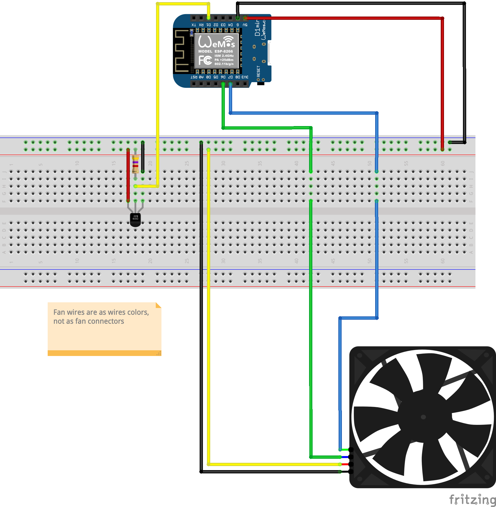

# ESP8266 Fan Control

Based on [this](https://github.com/stefanthoss/esp8266-fan-control).

This is a simple solution to have a fan, managed by a ESP8266.
By default, the speed of fan is automatically set based on the
temperature reported by the sensor.

This app is written in [micropython](https://micropython.org/).

## Usage

Before first upload, create two files on the device:
`wifi_SSID` and `wifi_pass`. You can use [`ampy`](https://github.com/scientifichackers/ampy)
for this.  Files should contain the SSID and password
of the WiFi network ESP8266 will connect to respectively.

Then upload `boot.py` and `main.py`. This also can be done using `ampy`.

Once connected to the WiFi, the controller will start a simple webserver with the following endpoints:

| Endpoint | Description |
| -------- | ----------- |
| `/` | Reports metrics in Prometheus format |
| `/setspeed/<number>` | Manually sets fan speed for `<number>`% of max RPM |
| `/auto` | Switches fan to automatic RPM mode (see below) |

The webserver only accepts GET requests. Any other verb will result
in HTTP 400 response.

## Modes

The device can operate in two modes: automatic (default) and manual.

### Automatic

In the automatic mode, the speed is set based on the temperature as
follows:

* < 21°C - the fan is off
* 21°C - the fan speed is set to 20% of max RPM
* 21°C - 27°C - fan speed increases linearly with each °C increase
till reaching 100% speed at 27°C
* \>= 27°C - fan is rotating at max RPM;

### Manual

Manual mode is enabled via `/setspeed` endpoint and allows setting
the fan speed manually as a percentage of the maximum RPM.

## Wiring

This project uses the following components:

* ESP8266 controller. I used D1 Mini Nodemcu;
* 5V PWM Fan. I used [NF-A4x10 5V PWM](https://noctua.at/de/products/fan/nf-a4x10-5v-pwmhttps://noctua.at/de/products/fan/nf-a4x10-5v-pwm), but any other should work as well;
* DS18B20 temperature sensor;
* 4.7 kΩ Resistor;
* Breadboard.

The diagram below shows the wiring for the project:

